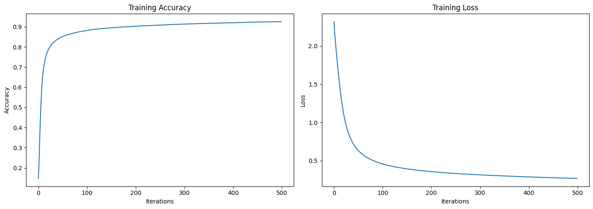

# Neural Network from Scratch with NumPy

## Overview

This project demonstrates how to build and train a simple neural network from scratch using only NumPy, without relying on high-level deep learning libraries such as TensorFlow or Keras. The network is applied to the MNIST dataset, a widely used benchmark for handwritten digit recognition. The goal is to provide a clear, educational implementation that covers all the essential steps of building, training, and evaluating a neural network.

---

## Mathematical Foundations

### 1. Network Architecture

- **Input Layer:** 784 neurons (28x28 pixels per image)
- **Hidden Layer:** Tunable size (e.g., 64, 110, 128), with ReLU activation
- **Output Layer:** 10 neurons (one per digit class), with softmax activation

### 2. Forward Propagation

Given input $X$:

- **Hidden Layer:**
  $$
  Z_1 = W_1 X + b_1
  $$
  $$
  A_1 = \text{ReLU}(Z_1)
  $$
  where $\text{ReLU}(z) = \max(0, z)$

- **Output Layer:**
  $$
  Z_2 = W_2 A_1 + b_2
  $$
  $$
  A_2 = \text{softmax}(Z_2)
  $$
  where
  $$
  \text{softmax}(z_i) = \frac{e^{z_i}}{\sum_j e^{z_j}}
  $$

### 3. Loss Function

We use the cross-entropy loss for multi-class classification:
$$
\mathcal{L} = -\frac{1}{m} \sum_{i=1}^m \log(A_2[y_i, i])
$$
where $y_i$ is the true label for sample $i$.

### 4. Backward Propagation

Gradients are computed as follows:

- **Output Layer:**
  $$
  dZ_2 = A_2 - \text{one\_hot}(Y)
  $$
  $$
  dW_2 = \frac{1}{m} dZ_2 A_1^T
  $$
  $$
  db_2 = \frac{1}{m} \sum dZ_2
  $$

- **Hidden Layer:**
  $$
  dZ_1 = W_2^T dZ_2 \odot \text{ReLU}'(Z_1)
  $$
  $$
  dW_1 = \frac{1}{m} dZ_1 X^T + \frac{\lambda}{m} W_1
  $$
  $$
  db_1 = \frac{1}{m} \sum dZ_1
  $$

where $\odot$ denotes element-wise multiplication and $\text{ReLU}'(z) = 1$ if $z > 0$, else $0$.

### 5. Parameter Update

Parameters are updated using gradient descent:
$$
W := W - \alpha \cdot dW
$$
$$
b := b - \alpha \cdot db
$$
where $\alpha$ is the learning rate.

---

## Project Structure

- **Data Preparation:**  
  The MNIST dataset is loaded, shuffled, and split into training, validation (dev), and test sets.

- **Network Initialization:**  
  Weights are initialized using He initialization for better convergence.

- **Activation Functions:**  
  - **ReLU:** For hidden layer non-linearity.
  - **Softmax:** For output probabilities.

- **Training:**  
  The model is trained using gradient descent, with support for L2 regularization and hyperparameter tuning (hidden layer size and regularization strength).

- **Evaluation:**  
  The model's performance is evaluated on both the validation and test sets, and training metrics are visualized.

- **Model Saving/Loading:**  
  The trained model parameters are saved and can be reloaded for future use.

---

## Results

### Training Metrics

The following plot shows the training accuracy and loss over the course of training:

- **Left:** Training accuracy vs. iterations  
- **Right:** Training loss vs. iterations

### Model Performance

After hyperparameter tuning, the best hidden layer size and regularization strength were selected. The final model was evaluated as follows:

- **Validation (Dev) Accuracy:**  
  *e.g.,* `0.92` (replace with your actual result)

- **Test Accuracy:**  
  *e.g.,* `0.91` (replace with your actual result)

Sample predictions and their corresponding true labels are printed in the notebook for qualitative assessment.

---

## How to Run

1. Place the MNIST `train.csv` file in the project directory.
2. Run the notebook cells sequentially.
3. The training metrics plot will be saved as `training_metrics.png`.
4. The trained model will be saved as `mnist_model.pkl`.

---

## Author

**Harsh**
